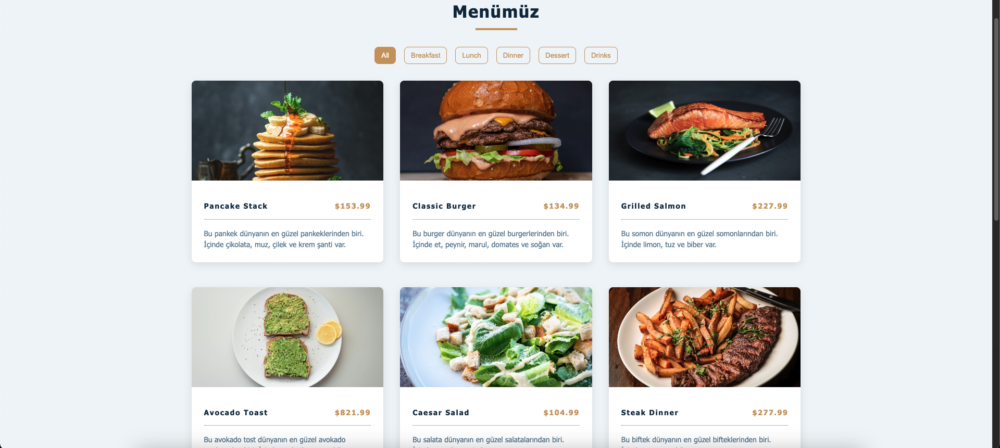

# Kitchens Menu

This project is a simple web application that displays a menu for a kitchen. It is built using the following technologies:

- **HTML**: For structuring the content.
- **CSS**: For styling the application.
- **JavaScript**: For adding interactivity and functionality.

## Features

- Displays a list of menu items.
- Allows filtering or categorizing menu items.
- Responsive design for better user experience on different devices.

## Screenshot




## Folder Structure

```
KitchensMenu/
├── index.html
├── script.js
└── README.md
```
