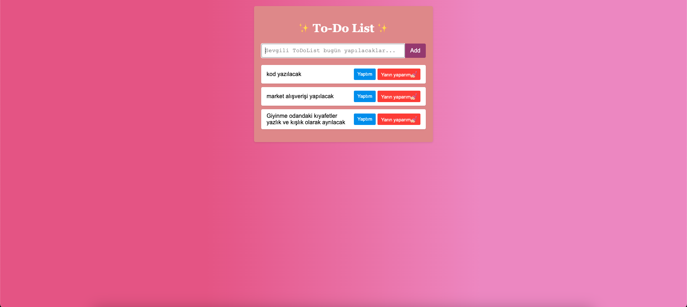

# To-Do List Application

This is a simple **To-Do List Application** built with HTML, CSS, and JavaScript. It allows users to add, mark as completed, and delete tasks.

# To-Do List Application

This is a simple **To-Do List Application** built with HTML, CSS, and JavaScript. It allows users to add, mark as completed, and delete tasks.




## Features

- Add new tasks to the list.
- Mark tasks as completed or undo them.
- Delete tasks from the list.
- Responsive design for mobile devices.

## Project Structure

```
ToDoList/
├── index.html       # Main HTML file
├── script.js        # JavaScript functionality
├── README.md        # Project documentation
```

## How to Use

1. Clone or download the repository.
2. Open the `index.html` file in your browser.
3. Use the input field to add tasks.
4. Click the "Yaptım" button to mark tasks as completed.
5. Click the "Yarın yaparım💅🏻" button to delete tasks.


## Technologies Used

- **HTML**: For the structure of the application.
- **CSS**: For styling and responsive design.
- **JavaScript**: For dynamic functionality.


Happy coding! 😊